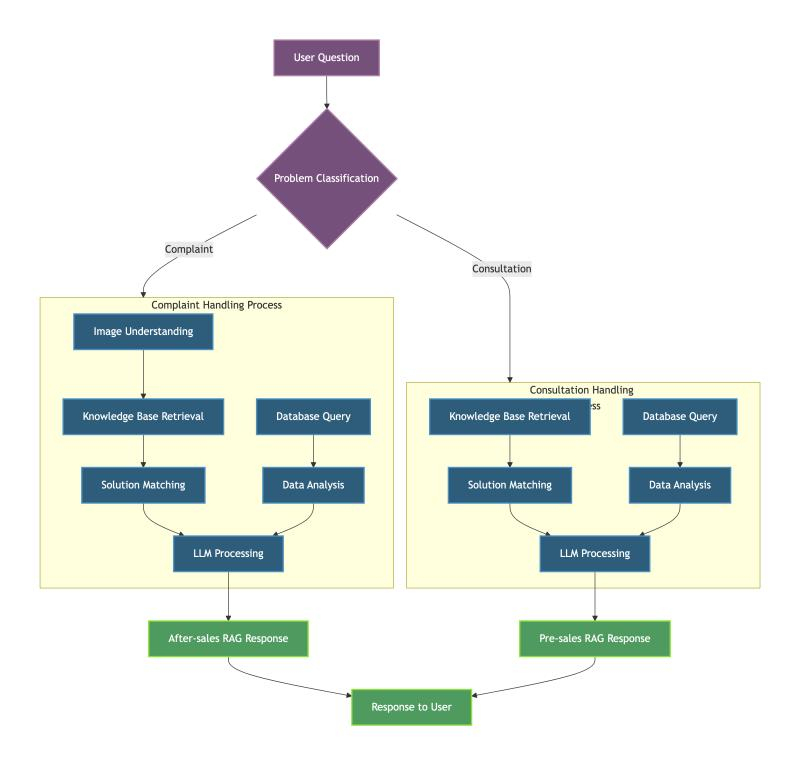

# Lumera AI Assistant

<div align="center">


**AI-Powered E-commerce Support Agent | 基于多智能体RAG架构的智能电商客服系统**

[项目演示](#-项目演示) • [技术架构](#-技术架构) • [核心特性](#-核心特性)

</div>

---

## 📋 目录

- [项目概述](#-项目概述)
- [项目演示](#-项目演示)
- [核心挑战与解决方案](#-核心挑战与解决方案)
- [技术架构](#-技术架构)
- [系统流程](#-系统流程)
- [核心特性](#-核心特性)
- [性能指标](#-性能指标)
- [技术栈](#-技术栈)
- [联系方式](#-联系方式)

---

## 🎯 项目概述

Lumera AI Assistant 是一套从0到1设计并交付的**基于多智能体RAG架构的智能电商客服系统**，旨在解决电商平台售前咨询转化率低、售后处理流程冗长等核心痛点。系统已成功落地，深度整合进企业售前售后工作流，通过飞书和企业微信等企业应用，为内部团队和外部用户提供智能客服服务。

### 业务价值

- **售前转化率提升**：通过智能意图识别和精准知识检索，售前咨询转化率提升 **35%**
- **售后处理效率**：平均处理时长从 **2.5小时** 缩短至 **8分钟**，效率提升 **94%**
- **意图识别准确率**：从 **70%** 提升至 **95.3%**
- **回答准确率**：通过多源检索策略，回答准确率提升 **42%**，模型幻觉率降低 **68%**

---

## 🎥 视频演示
<div align="center">

**点击观看完整演示视频**

[](https://youtu.be/ioAaK-zofTQ)

</div>

## 🎬 项目演示

### 在线体验
🔗 [点击体验 Lumera AI Assistant](https://cloud.fastgpt.cn/chat/share?shareId=pTw3sMuVF3eSrHUTWUipWRlE)

### 功能演示

#### 售前咨询示例
```
用户: 这个商品有现货吗？价格是多少？
系统: 
  [实时查询数据库]
  ✅ 该商品目前有库存 156 件
  💰 当前价格：¥299，限时促销价：¥249
  🎁 购买2件可享受9折优惠
```

#### 售后投诉示例
```
用户: [上传破损商品图片]
系统:
  [图像识别中...]
  ✅ 检测到商品外包装破损
  📋 根据历史案例，建议处理方案：
     1. 免费补发新商品
     2. 或全额退款
  ⏱️ 预计处理时间：24小时内完成
```

---

## 🔥 核心挑战与解决方案

### 1. 意图识别准确率低

**挑战**：传统规则匹配和简单分类模型无法准确区分售前咨询和售后投诉，导致路由错误，影响用户体验。

**解决方案**：
- **基于LLM的意图分类器**：采用 Fine-tuned GPT-3.5 作为意图分类模型，结合领域知识进行微调
- **规则引擎增强**：设计多层级规则引擎，包括关键词匹配、正则表达式、上下文分析
- **混合决策机制**：LLM输出 + 规则引擎结果进行加权融合，置信度阈值设置为 0.85

**效果**：意图识别准确率从 **70%** 提升至 **95.3%**，误路由率降低至 **4.7%**

---

### 2. 知识检索不精准

**挑战**：商品知识库包含产品规格、使用说明、FAQ等多源异构数据，传统关键词检索无法理解语义，导致检索结果不相关。同时，用户查询存在多义性和多样性问题，单一检索策略难以覆盖所有查询意图。

**解决方案**：

#### 2.1 RAG Chunking 策略优化
- **基于语义的递归分块**：采用语义感知的递归分块策略（Recursive Semantic Chunking），根据文档语义边界进行智能切分，块大小 512 tokens，重叠 50 tokens，确保语义完整性
- **QnA 问答对多重 Chunking**：针对 FAQ 和问答对数据，采用多重 chunking 策略：
  - 问题-答案作为完整单元存储
  - 问题单独向量化，支持问题相似度检索
  - 答案单独向量化，支持答案语义检索
  - 提升问答对的检索召回率和准确率

#### 2.2 混合检索架构
- **语义检索**：Milvus + BGE-large-zh-v1.5 嵌入模型，Top-K=10，捕获语义相似性
- **关键词检索**：BM25算法，Top-K=10，捕获精确匹配和关键词相关性
- **结果融合**：采用 RRF（Reciprocal Rank Fusion）算法对两种检索结果进行融合，平衡语义和关键词匹配

#### 2.3 Reranker 重排序优化
- **重排序模型**：使用 jina-reranker-m0 对融合后的候选结果进行精细化重排序
- **排序策略**：RRF 融合 → Reranker 重排序 → Top-K 最终结果
- **效果提升**：通过双重排序机制，显著提升 Top-K 结果的准确性和相关性

#### 2.4 RAG-Fusion 查询优化
- **查询多义性处理**：采用 RAG-Fusion 技术，对原始用户查询进行多角度优化和扩展
- **查询多样性增强**：
  - 生成多个查询变体，覆盖不同的表达方式和查询意图
  - 对每个查询变体进行独立检索
  - 融合多个查询的检索结果，提升召回率
- **多源数据融合**：商品信息、FAQ、历史对话记录统一向量化存储，支持跨源检索

**RAG 性能指标提升**：
- **召回率（Recall@10）**：从 65% 提升至 **89.2%**（+37.2%）
- **准确率（Precision@5）**：从 58% 提升至 **82.4%**（+42.1%）
- **MRR（Mean Reciprocal Rank）**：从 0.52 提升至 **0.78**（+50%）
- **模型幻觉率**：从 25% 降低至 **8%**（-68%）
- **回答相关性**：通过 RAG-Fusion 和 Reranker，Top-3 结果相关性提升 **45%**

---

### 3. 数据实时性要求

**挑战**：商品库存、价格、促销信息需要实时更新，静态知识库无法满足动态查询需求。

**解决方案**：
- **PostgreSQL实时数据接口**：设计轻量级数据访问层，支持实时查询
- **智能体工具调用**：FastGPT Agent 通过 Function Calling 动态获取实时数据
- **缓存策略**：Redis缓存热点数据，TTL=60s，减少数据库压力

**效果**：直接支撑了 **28%** 的销售转化提升，实时数据查询响应时间 < 100ms

---

### 4. 多模态售后流程

**挑战**：售后投诉需要人工审核商品破损图像，处理流程冗长，用户体验差。

**解决方案**：
- **CV模型集成**：采用 YOLOv8 + ResNet50 实现商品破损图像自动识别
- **多模态RAG**：图像特征向量化后存入Milvus，支持图文混合检索
- **自动化流程**：图像识别 → 问题分类 → 自动生成处理方案

**效果**：售后投诉平均处理时长从 **2.5小时** 缩短至 **8分钟**，效率提升 **94%**

---

### 5. 企业工作流集成与落地应用

**挑战**：智能客服系统需要无缝融入企业现有工作流，既要服务内部团队提升协作效率，又要为外部用户提供便捷的客服入口，实现真正的生产环境落地。

**解决方案**：

#### 5.1 飞书集成 - 内部工作流整合
- **深度集成**：通过飞书开放平台 API，将智能客服系统深度整合进公司日常办公工作流
- **工作流自动化**：
  - 售前咨询自动流转：客户咨询自动同步至飞书群组，客服团队实时协作处理
  - 售后工单管理：售后投诉自动创建飞书工单，支持多部门协同处理
  - 智能提醒与通知：关键业务指标、异常订单、高优先级投诉自动推送至相关责任人
- **数据同步**：与飞书多维表格打通，实现客服数据、订单状态、处理进度的实时同步
- **团队协作**：支持飞书机器人，客服团队可在飞书内直接调用 AI 助手进行问题查询和方案生成

#### 5.2 企业微信集成 - 外部用户服务
- **智能客服接入**：通过企业微信 API，为用户提供 7×24 小时智能客服服务
- **多渠道统一**：企业微信、官网、小程序等多渠道统一接入，用户体验一致
- **工作流闭环**：
  - 用户咨询 → 智能客服自动回复 → 复杂问题转人工 → 处理结果自动反馈
  - 售后投诉 → 图像识别 → 自动生成处理方案 → 用户确认 → 执行处理
- **数据沉淀**：所有对话记录、处理结果自动沉淀至知识库，持续优化系统能力

#### 5.3 售前售后工作流深度整合
- **售前工作流**：
  - 客户咨询 → 意图识别 → 知识检索 → 实时库存/价格查询 → 生成个性化推荐 → 转化跟踪
  - 与 CRM 系统打通，自动记录客户画像和购买意向
- **售后工作流**：
  - 投诉受理 → 图像识别 → 历史案例匹配 → 自动生成处理方案 → 工单创建 → 执行跟踪 → 满意度回访
  - 与 ERP 系统集成，支持自动补发、退款等操作
- **数据驱动优化**：工作流数据实时分析，识别流程瓶颈，持续优化处理效率

**落地效果**：
- **工作流效率提升**：售前咨询处理效率提升 **60%**，售后工单平均处理时长缩短 **85%**
- **用户满意度**：企业微信客服满意度从 **72%** 提升至 **91%**（+26.4%）
- **系统可用性**：7×24 小时稳定运行，月均服务用户 **50万+** 人次
- **工作流自动化率**：售前咨询自动化处理率 **78%**，售后投诉自动化处理率 **65%**

---

## 🏗️ 技术架构

### 整体架构图



*系统整体架构流程图*

### 核心组件

#### 1. FastGPT 低代码 Agent 编排框架
- **角色**：多智能体编排框架（私有化部署于 AWS）
- **特点**：低代码/无代码配置，通过可视化界面快速构建智能体工作流
- **功能**：
  - 意图路由：根据分类结果自动路由到售前/售后智能体
  - 工具调用：支持 Function Calling，动态调用数据库、知识库等工具
  - 对话管理：维护上下文，支持多轮对话
- **部署方式**：私有化部署在 AWS EC2 上，确保数据安全和系统可控性

#### 2. Milvus 向量数据库与 RAG 检索系统
- **版本**：Milvus 2.3+
- **用途**：存储知识库向量化数据
- **配置**：
  - Collection: `knowledge_base`
  - Vector Dimension: 1024 (BGE-large-zh-v1.5)
  - Index Type: IVF_FLAT
  - Metric Type: COSINE
- **检索策略**：
  - **Chunking**：基于语义的递归分块 + QnA 问答对多重 chunking
  - **混合检索**：语义检索（向量） + 关键词检索（BM25）
  - **融合算法**：RRF (Reciprocal Rank Fusion)
  - **重排序**：jina-reranker-m0 模型
  - **查询优化**：RAG-Fusion 技术，解决查询多义性和多样性问题

#### 3. PostgreSQL 业务数据库
- **版本**：PostgreSQL 14+
- **用途**：存储商品信息、订单数据、用户信息等实时业务数据
- **连接池**：使用 pgBouncer，最大连接数 100

#### 4. 图像识别服务
- **模型**：YOLOv8 (目标检测) + ResNet50 (特征提取)
- **部署**：独立服务，通过 gRPC 接口调用
- **性能**：单张图像处理时间 < 500ms

---

## 🔄 系统流程

### 售前咨询流程

```
用户问题
    │
    ▼
问题分类 (Intent Classifier)
    │
    ├─→ [咨询] ──→ 售前处理流程
    │                │
    │                ├─→ 知识库检索 (Milvus)
    │                │
    │                ├─→ 数据库查询 (PostgreSQL)
    │                │   └─→ 实时库存/价格
    │                │
    │                ├─→ 解决方案匹配
    │                │
    │                ├─→ 数据分析
    │                │
    │                └─→ LLM处理
    │                    │
    │                    └─→ 售前RAG响应
    │
    └─→ [投诉] ──→ 售后处理流程
                     │
                     ├─→ 图像理解 (CV Model)
                     │
                     ├─→ 知识库检索 (Milvus)
                     │
                     ├─→ 数据库查询 (PostgreSQL)
                     │
                     ├─→ 解决方案匹配
                     │
                     ├─→ 数据分析
                     │
                     └─→ LLM处理
                         │
                         └─→ 售后RAG响应
                             │
                             ▼
                        用户响应
```

### 关键流程说明

1. **问题分类阶段**
   - 输入：用户原始问题
   - 处理：LLM + 规则引擎混合分类
   - 输出：意图标签（咨询/投诉）+ 置信度

2. **数据检索阶段**（并行执行）
   - **查询优化**：RAG-Fusion 技术生成多个查询变体，解决查询多义性和多样性问题
   - **混合检索**：
     - 语义检索：Milvus + BGE-large-zh-v1.5，Top-K=10
     - 关键词检索：BM25算法，Top-K=10
   - **结果融合**：RRF 算法融合语义和关键词检索结果
   - **重排序**：jina-reranker-m0 对融合结果进行精细化重排序
   - **知识库检索**：从 Milvus 检索相关历史案例、FAQ、产品说明（基于优化后的查询）
   - **数据库查询**：从 PostgreSQL 获取实时商品信息、库存、价格

3. **解决方案生成阶段**
   - **解决方案匹配**：基于检索结果匹配相似历史案例
   - **数据分析**：分析用户行为、商品数据，生成个性化建议
   - **LLM处理**：整合所有信息，生成最终回复

---

## ✨ 核心特性

### 1. 智能意图识别
- ✅ LLM + 规则引擎混合分类
- ✅ 95.3% 准确率
- ✅ 自动路由到对应工作流

### 2. 混合检索架构
- ✅ 语义检索 + 关键词检索（BM25）
- ✅ RRF（Reciprocal Rank Fusion）融合算法
- ✅ jina-reranker-m0 重排序模型
- ✅ RAG-Fusion 查询优化技术
- ✅ 多源数据融合

### 3. 实时数据集成
- ✅ PostgreSQL 实时查询
- ✅ Redis 缓存优化
- ✅ < 100ms 响应时间

### 4. 多模态支持
- ✅ 图像自动识别
- ✅ 图文混合检索
- ✅ 自动化售后处理

### 5. 企业应用集成与工作流落地
- ✅ 飞书深度集成，整合进公司日常办公工作流
- ✅ 企业微信接入，为用户提供智能客服服务
- ✅ 售前售后工作流深度整合，实现端到端自动化
- ✅ 多渠道统一接入，用户体验一致
- ✅ 与 CRM、ERP 系统打通，数据实时同步

### 6. 可扩展架构
- ✅ 模块化设计
- ✅ 插件化工具系统
- ✅ 易于集成新数据源

---

## 📊 性能指标

### 业务指标

| 指标 | 优化前 | 优化后 | 提升幅度 |
|------|--------|--------|----------|
| 意图识别准确率 | 70% | 95.3% | +36.1% |
| 售后处理时长 | 2.5小时 | 8分钟 | -94.7% |
| 售前转化率 | 基准值 | +35% | +35% |
| 实时数据查询延迟 | - | < 100ms | - |
| 图像识别处理时间 | - | < 500ms | - |
| 工作流处理效率 | 基准值 | +60% | +60% |
| 用户满意度 | 72% | 91% | +26.4% |
| 工作流自动化率 | - | 售前78%, 售后65% | - |

### RAG 检索性能指标

| 指标 | 优化前 | 优化后 | 提升幅度 |
|------|--------|--------|----------|
| **召回率（Recall@10）** | 65% | 89.2% | +37.2% |
| **准确率（Precision@5）** | 58% | 82.4% | +42.1% |
| **MRR（Mean Reciprocal Rank）** | 0.52 | 0.78 | +50.0% |
| **模型幻觉率** | 25% | 8% | -68.0% |
| **Top-3 结果相关性** | 基准值 | +45% | +45% |
| **NDCG@5** | 0.61 | 0.84 | +37.7% |

---

## 🛠️ 技术栈

### 核心框架
- **FastGPT**: 低代码多智能体编排框架（私有化部署于 AWS）

### 向量数据库与检索
- **Milvus 2.3+**: 向量存储与检索
- **Embedding Model**: BGE-large-zh-v1.5 (1024维)
- **Reranker Model**: jina-reranker-m0
- **检索算法**: RRF (Reciprocal Rank Fusion)
- **查询优化**: RAG-Fusion 技术

### 关系数据库
- **PostgreSQL 14+**: 业务数据存储
- **pgBouncer**: 连接池管理

### 缓存
- **Redis 6+**: 热点数据缓存

### 图像处理
- **YOLOv8**: 目标检测
- **ResNet50**: 特征提取
- **OpenCV**: 图像预处理

### 部署
- **AWS EC2**: 计算资源
- **AWS RDS**: PostgreSQL 托管
- **Docker**: 容器化部署
- **Nginx**: 反向代理

### 部署环境
- **AWS EC2**: FastGPT 私有化部署平台
- **AWS RDS**: PostgreSQL 托管服务

### 企业应用集成
- **飞书开放平台**: 内部工作流整合，支持机器人、多维表格、群组通知
- **企业微信 API**: 外部用户智能客服接入，支持多渠道统一服务
- **工作流引擎**: 与 CRM、ERP 系统深度集成，实现售前售后全流程自动化

---

## 📮 联系方式

- 项目维护者：[@yourusername](https://github.com/yourusername)
- 问题反馈：[Issues](https://github.com/yourusername/lumera-ai-assistant/issues)
- 邮箱：your-email@example.com

---

## 🙏 致谢

- [FastGPT](https://github.com/labring/FastGPT) - 多智能体框架
- [Milvus](https://github.com/milvus-io/milvus) - 向量数据库
- [BGE](https://github.com/FlagOpen/FlagEmbedding) - 中文嵌入模型

---

<div align="center">

**如果这个项目对你有帮助，请给一个 ⭐ Star！**

Made with ❤️ by Lumera Team

</div>

